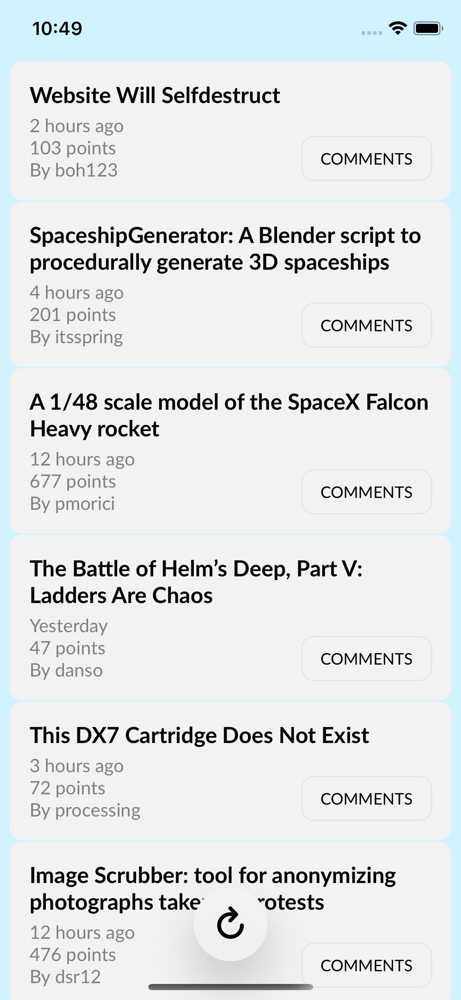
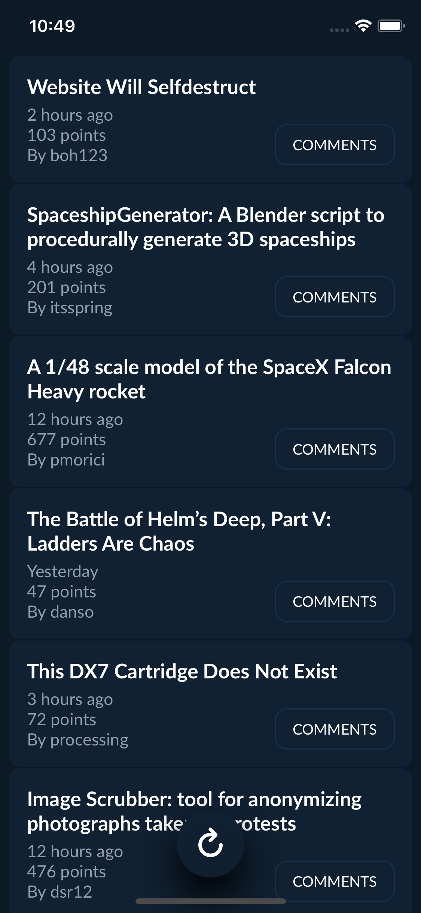

# Hackery
A HackerNews client made using SwiftUI

Please replace the `GoogleService-Info.plist` file with your own (from Firebase) if you're planning to use the app frequently. Thanks. :)

Also, consider making a pull request if you think you can help improve the app!

### Screenshots

  
  

### Requirements
Xcode 11, iOS 13 (Works on iPhone and iPad)
