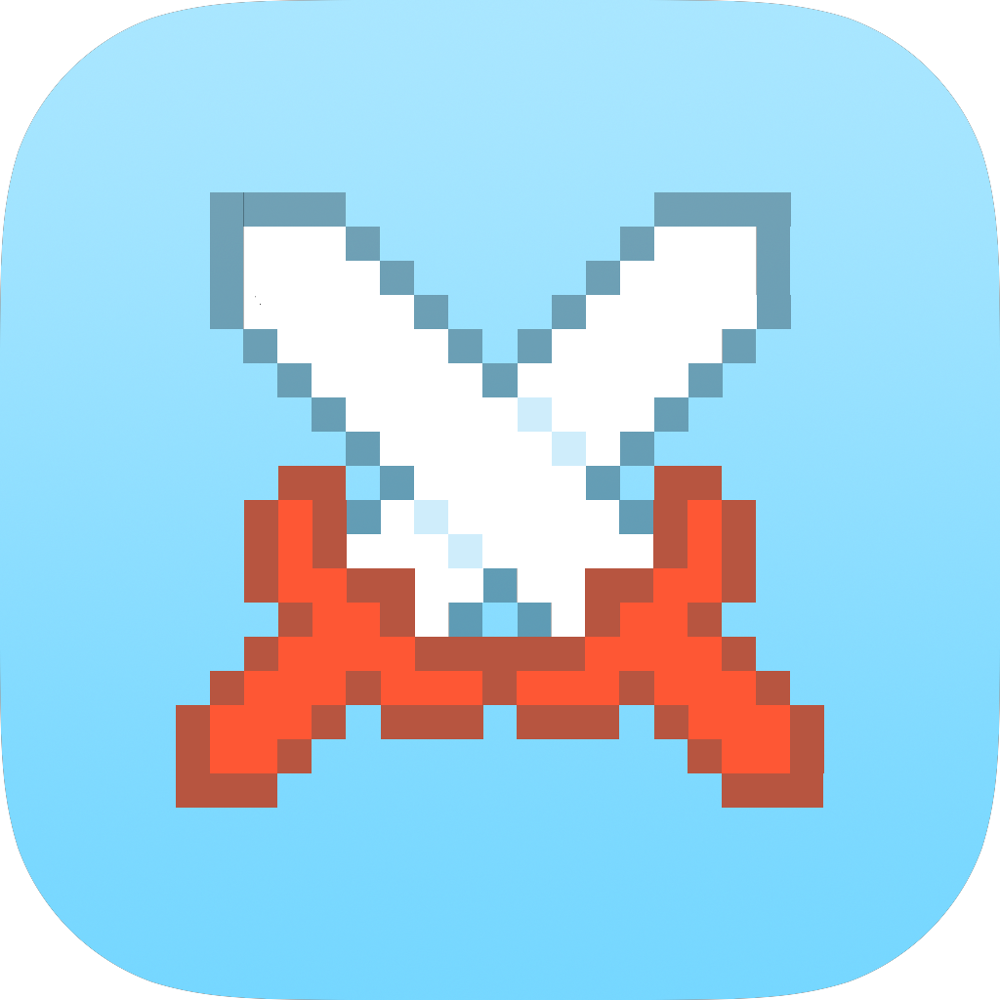
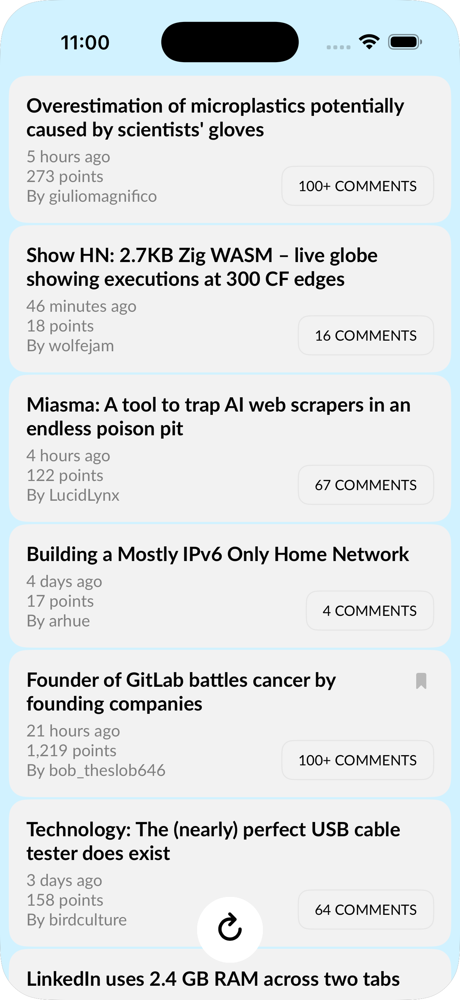
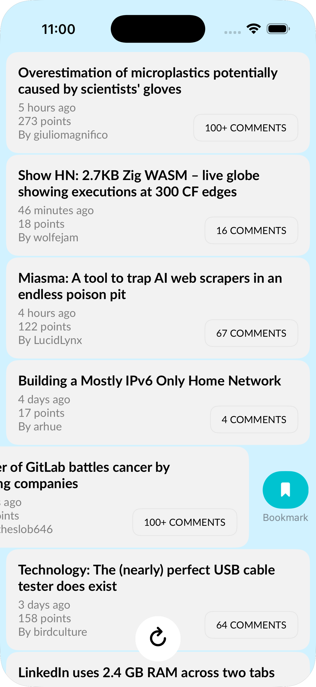
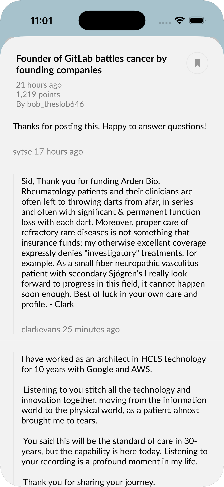
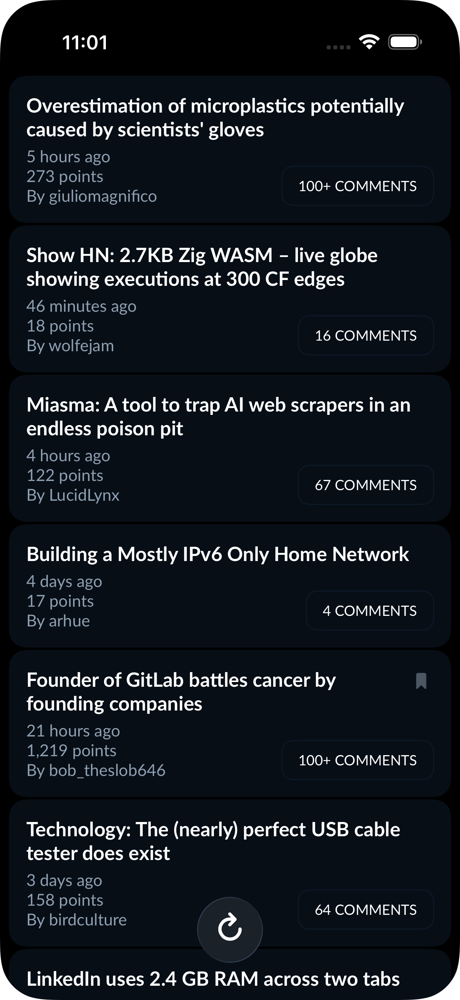
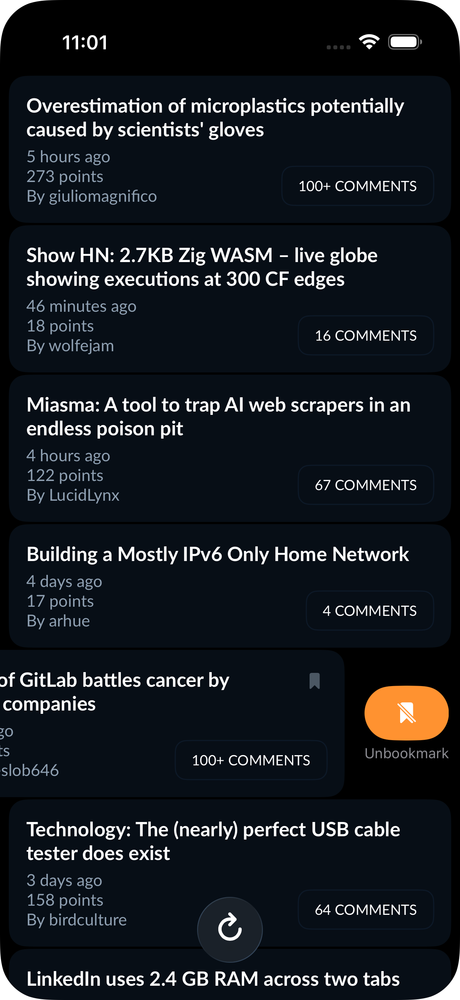
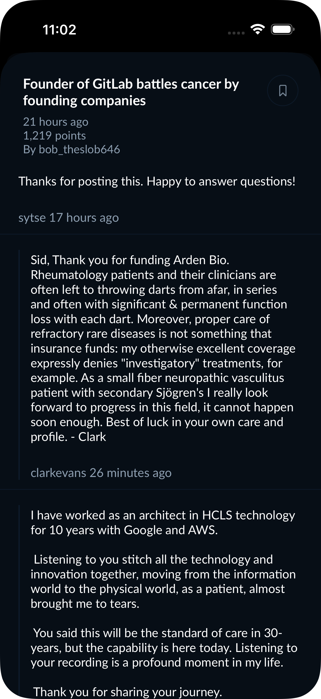

# Hackery
A beautiful Hacker News client built entirely with SwiftUI.

### Features
- **SwiftUI Lifecycle** — Pure SwiftUI app with no UIKit app delegate.
- **Bookmarks with CloudKit Sync** — Swipe any story to bookmark it. Bookmarks persist with SwiftData and sync across devices via CloudKit.
- **Swipeable Bookmarks Page** — Swipe right from the feed to reveal your saved stories in a custom page carousel.
- **Threaded Comments** — Tap the comment count to read the full discussion with indented, threaded replies and infinite scroll.
- **In-App Safari Reader** — Stories open in SFSafariViewController with Reader Mode enabled by default.
- **Infinite Scroll with Pagination Glow** — Stories and comments load progressively with an animated gradient glow indicator.
- **Offline Cache** — The feed is cached locally so stories appear instantly on relaunch (30-minute TTL).
- **Dark Mode** — Full light and dark mode support with custom color theming.
- **visionOS Support** — Runs natively on Apple Vision Pro with ornament controls, hover effects, and glass background materials.
- **iPad Support** — Adaptive layout for iPad.

### Screenshots

#### Light Mode

  
  
  

#### Dark Mode

  
  
  

### Requirements
Xcode 26, iOS 26 (Works on iPhone, iPad, and Apple Vision Pro)

### Contributing
Consider making a pull request if you think you can help improve the app!
